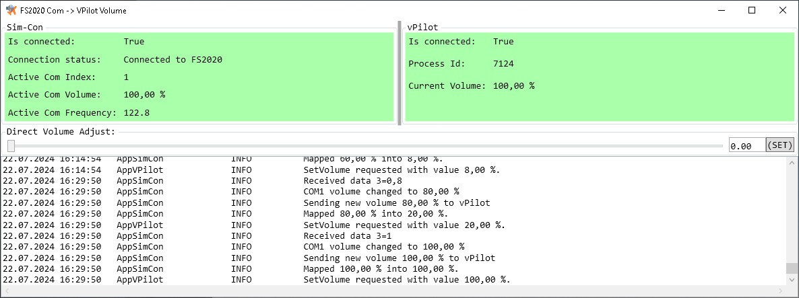

# 🔉🔊FS2020 COM Volume to vPilot Volume

### What?

A simple tool synchronizing in-plane **COM radio volume with vPilot** output volume.

### Why?

VPilot offers no possibility to directly adjust output volume when ATC or another pilot is speaking over VATSIM - only via the Settings panel.

### How?

Fortunately, Windows OS can adjust output volume per application.
This app gets the %&nbsp;of COM volume from FS2020 and sets it as a percentage of
volume of VPilot in Windows Audio Mixing Panel.

### For FS2024?

Not tested, but as the internal principle of SimVars in FS2024 remains the same as in FS2020, it should work. Don't hesitate and let me know.

### For any plane?
Simply say, yes. All default planes are supported (as they use internaly the same, default SimVars (simulation variables) managing COM volume. Addon planes may use custom SimVars to handle COM volume. For those planes you can change the appropriate SimVar in settings. See the configuration file (on Wiki pages) for more info.

## Instalation

App is provided as ZIP file.

The newest release is available at the [Releases](https://github.com/Engin1980/fs2020-com-to-vpilot-volume/releases) page. Simply download and unzip (see note below) the release package to your custom folder.

**Unzip Note**: If using Windows default extractor, you need to disable ZIP file blockage (on by default on Windows). On the ZIP file, in the context menu select `Properties` and on the right bottom part of the dialog select `Unblock`.

[.NET 8.0 Runtime](https://dotnet.microsoft.com/en-us/download/dotnet/8.0) is required to run the application (commonly installed on Windows OS by default).

## Usage

For simple usage, just start the application using `Com2vPilotVolume.exe`.

The app automatically looks for and connects to FS2020 and also looks for vPilot
running instance. If both were found, the app synchronizes FS2020 COM volume to
vPilot volume via Windows Audio Mixing panel.

The successful connection is indicated by changing the background (red) color (to green one).

## More Info

For more info about principle, implementation or configuration see [Project Wiki](https://github.com/Engin1980/fs2020-com-to-vpilot-volume/wiki).

## Version history

**v0.7.0 - 2025-11-13**
* Added key hooks
* Internally rewritten to new concept of services
* Migrated to .NET 8

**v0.4.1 - 2025-08-02**
* Minimization into the System Tray icon.

**v0.4.0 - 2024-07-22**
* New mapping input->output volume based on linear segments.

**v0.3.2 - 2024-04-23**
* Improved logging and configuration file.
* Added support for initial COM frequency tuning

**v0.3.0 - 2024-04-22**
* Added support for sound notifications

**v0.2.0 - 2024-04-21**
* Added postponed custom variable initialization when FS2020 is ready

**v0.1.1-beta - 2024-04-08**
* Initial release
* Can connect to FS2020
* Can use custom variables
* Multiplier added to adjust vPilot volume mapping

## Credits

Created by Marek Vajgl.

Project pages: https://github.com/Engin1980/fs2020-com-to-vpilot-volume

Report issues via the [Issues](https://github.com/Engin1980/fs2020-com-to-vpilot-volume/issues) tab on the project GitHub pages.
